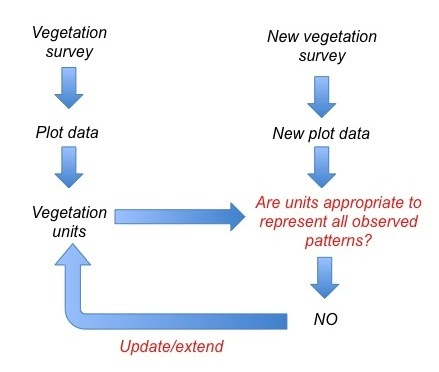
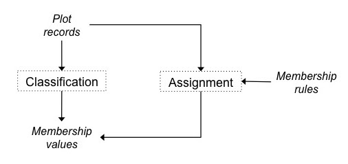
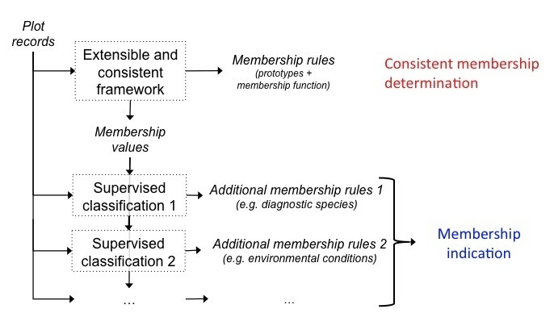

**The post provided by:** Miquel De Cáceres
(taken from the old VCWG website: [link](https://sites.google.com/site/vegclassmethods/statistical-analyses/general-concepts?authuser=0))
## Main concepts

### Preliminary definitions

It is our aim to maintain a consistent notation throughout this website.

- **Vegetation observations**: sampling units such as plot-based records (e.g. relevé) but they can have other forms (e.g. pixels of a satellite image).
- **Vegetation type**: a grouping of vegetation observations at any level of abstraction, based on a set of relevant features.
- **Classification system**: a set of vegetation types, which can belong to a single abstraction level or be organized into different abstraction levels (e.g. associations, alliances, divisions, formations, classes).

### Defining vegetation types

We suggest that four main activities regarding the definition of vegetation types should be distinguished:

1. **Membership determination**: Grouping vegetation observations, or assigning a given observation to a pre-existing vegetation type or defining how the assignment should be conducted
2. **Characterization**: Production of attributes that apply to a (set of) vegetation type(s).
3. **Validation**: Determining whether a given vegetation type (or the entire classification) is acceptable for a given application or not.
4. **Naming**: Assigning a label to each vegetation type, according to a set of conventions.

Membership determination is an activity related to deciding which vegetation observations belong to which types. Membership determination answers the question “How do I group my vegetation observations?” or “Which type does this particular observation belong to?” This contrasts to the questions answered by characterization (“What are the attributes of my grouping?”), validation (“Is this grouping acceptable for my purpose?”) and naming (“How do we refer to this grouping?”).

### Membership statements and membership rules

We will use the term _**membership statement**_ to denote an expression specifying which vegetation observations belong to which vegetation types (e.g. “plot records a, b and c belong to vegetation type X, whereas plot record d does not belong to it”). A vector containing either 0s or 1s is a numerical way to represent membership statements of a set of vegetation observations to a given type. Membership can be a continuous variable, not only binary, and be interpreted as a probability (e.g. “plot record e belongs to unit X with probability 0.7”) or be fuzzy (e.g. “plot record f has a membership degree of 0.6 to unit Y and a membership degree of 0.4 to unit Z”).

We will use the term _**membership rule**_ to denote a procedure that allows individual vegetation observations to be assigned to vegetation types, i.e. membership rules are classifiers. Simple examples of membership rules are: “a plot record belongs to vegetation type Y if its altitude lies within a given altitudinal range” or “a plot record belongs to vegetation type Y if species A occurs among the list of species recorded”. Examples of more complex rules would be a hierarchical vegetation key, a set of species groups plus a formal logic statement combining them, a fuzzy membership function based on the distances of the target observation to a set of cluster prototypes or a trained neural network. Moreover, two or more membership rules may be combined to create a compound rule.

### Determination of membership to vegetation types

Different activities can be generally referred to as ‘classification’. In the following discussion we distinguish four fundamentally different activities regarding the determination of membership to vegetation types:

1. **Expert-based rule definition** : Definition of a membership rule from expert knowledge without any explicit reference to vegetation observations.
2. **Unsupervised classification** : Classification of unlabelled vegetation observations into subsets or clusters on the basis of similar vegetation attributes. The result is a set membership statements, but membership rules may also be obtained in some cases.
3. **Supervised classification** : Inference of a membership rule (i.e. a classifier) from a set of training vegetation observations whose membership statements are known in advance.
4. **Assignment**: Application of a membership rule to a vegetation observation to obtain a membership statement.

## Beyond a given data analysis: Classification frameworks

### Classification of vegetation as a dynamic entity

Any classification of vegetation is provisional, in the sense that it may need modification in future. The process starts with an initial vegetation survey, which allows deriving an initial set of vegetation types. The characterization of these types provides meaning to those classes, opening the door to use them as vegetation concepts. Later on, new vegetation observations may become available, either from the exploration of new areas or from revisiting the same locations that were initially sampled. These new vegetation observations will be compared to the vegetation types and, if possible, assigned to them. When conducting these assignments, one may discover that some vegetation observations do not fit into any of the initial type. This finding may lead to defining new vegetation types or to modify the existing ones. In any moment, the vegetation type should be able to represent the known variation in plant community composition that exists across the target area.

### Consistency in assignments

Membership rules are **consistent** with membership values if assignment of the same plot records produces the same membership values. This concept is illustrated in the figure below.

If membership rules are consistent then assignment of new plot records will be done in accordance with how the original classification was obtained. For example, imagine that the initial membership statements are “plot records a, b and c belong to vegetation type X” and “plot records d and e belong to vegetation type Y”. Now imagine a membership rule that determines membership to either unit X or unit Y based on the spectrum of Raunkiaer’s life forms found in the plot record. The assignment with this rule is consistent with the original statements if and only if the rule assigns records a-c to X and records d-e to Y. If not, we may say that the assignment is indicative of the membership statements, but we cannot state that the assignment is consistent with the initial classification.

### Supervised classification and diagnostic methods

Supervised classification methods allow generating a classification rule from a set of vegetation observations of known membership. The aim is that this rule can be used to classify new vegetation observations. Supervised techniques are useful in two main cases:

- A classification of vegetation exists for a set of vegetation observation but we do not know how to consistently assign new observations into these classes. This is the case for many legacy classification schemes derived from the Braun-Blanquet method.
- Even we already have a rule to classify new observations into our vegetation types, we may still want to have additional ways to assign observations. These [additional diagnostic approaches](https://sites.google.com/site/vegclassmethods/statistical-analyses/diagnostic-methods?authuser=0) will not provide the same answer to the membership of vegetation observations, but can be used as indicators (e.g. diagnostic species). This second case is illustrated in the figure below:

---
[All Blog Posts](VCWG%20Blog%20Posts.md)
[Home Page](index.md)
