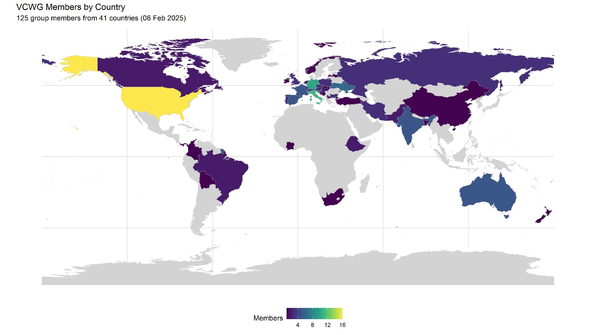
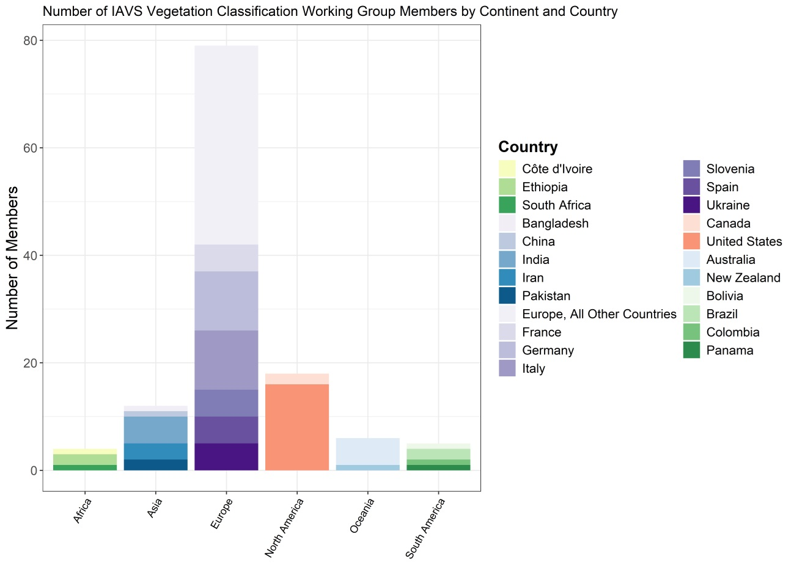

# Vegetation Classification Working Group
# VCWG Newsletter 1

## February 2025

([Newsletter in PDF](VCWG_Newsletter1.pdf))

## *Dear VCWG Members*

We are happy to launch the VCWG Newsletter, a new initiative starting in 2025 to keep you informed about all activities related to the Vegetation Classification Working Group (VCWG) of IAVS. We plan to share short news several times per year about our activities, new initiatives, publications, blog posts, and more.

## Membership Update
Recently, we invited all members to renew their VCWG membership to update our database. We are pleased to report that we now have 125 members from 41 countries:

Map presenting VCWG members density for countries

Stacked chart showing the number of members by continent and country

If you know colleagues interested in joining, please share the registration form with them: [form](https://forms.gle/t4RJHPVHh63o9iVq6)

## New Steering Committee

Following the restructuring in 2024, our new VCWG Steering Committee consists of:
• **Denys Vynokurov** (Chair) – Martin Luther University Halle-Wittenberg, Germany & M.G. Kholodny Institute of Botany, Ukraine
• **Aaron Wells** (Secretary) – AECOM Technical Services, USA
• **Jorge Capelo** – Instituto Nacional de Investigação Agrária e Veterinária, Portugal & Universidade do Porto, Portugal
• **John T. Hunter** – University of New England, Australia
• **Corrado Marcenò** – Università degli Studi di Perugia, Italy

## Join Us on Social Media

We now have official **VCWG groups on Facebook and Bluesky**! 
Join us here: **Facebook**: [link](https://www.facebook.com/groups/1120871432995026) **Bluesky**: [link](https://bsky.app/profile/wgvc-iavs.bsky.social)

Feel free to share these links with colleagues who might be interested!

## VCWG Website – Coming Soon
We are working on a VCWG website that will bring together all our activities, resources, and updates in one place. We’ll let you know as soon as it’s ready!

## Call for 2024 Publications
We are compiling a list of **publications of our members from 2024** on vegetation classification, covering everything related to different aspects of vegetation classification: global classifications, methodological developments, regional classification studies, etc. If you have published relevant papers this year, please **send them to Aaron Wells** (Aaron.Wells@aecom.com), and we will include them in our next Newsletter and on the upcoming website.

## Call for VCWG Special Session at the 67th IAVS Annual Symposium 
“***Bringing the Different Vegetation Classification Approaches Together***”

We invite you to join our special session at the upcoming IAVS Annual Symposium in Greeley, Colorado (29 July – 3 August 2025). The session will aim to unite diverse vegetation classification approaches – from phytosociology and EcoVeg to phylogenetic classifications and biome delineation – and explore ways to move toward a unified framework. Integrative contributions that combine multiple classification systems are particularly welcome!
Based on the session contributions, we aim to launch a Special Collection in Vegetation Classification and Survey. For more details, please check the conference website (launching soon).

Thank you for being part of VCWG! We look forward to a productive and collaborative year ahead.

## *Best regards*
*VCWG Steering Committee*

---
[Home Page](index.md)
