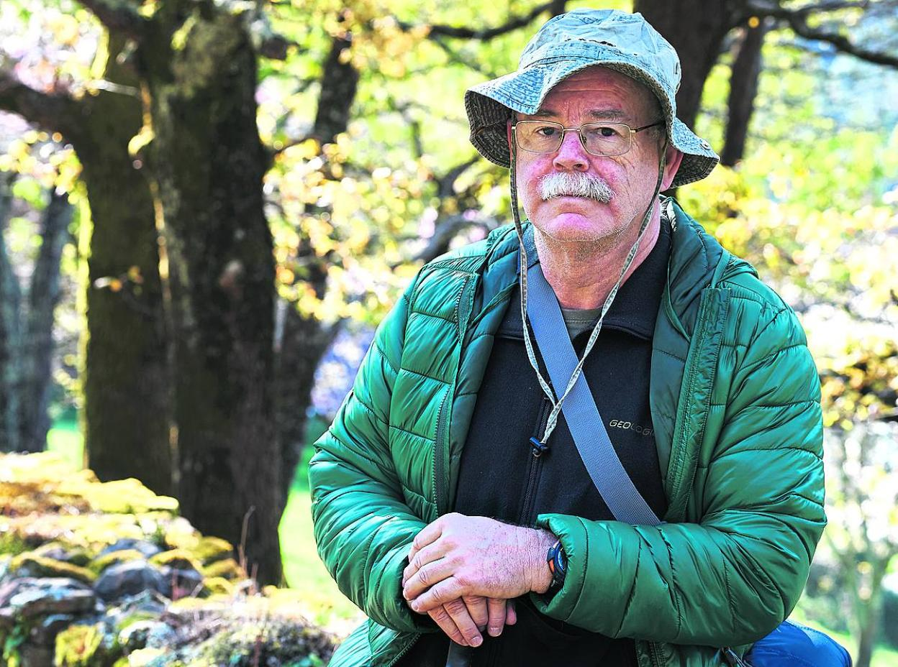
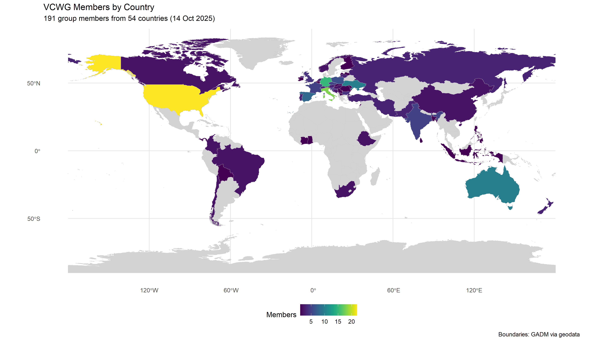

# Vegetation Classification Working Group
# VCWG Newsletter 2

## October 2025

([Newsletter in PDF](VCWG_Newsletter2.pdf))

## *Dear VCWG Members*

Welcome to the second issue of the **VCWG Newsletter**, where we share the latest developments and upcoming plans of the Vegetation Classification Working Group (VCWG) of IAVS. This issue presents our new online seminars, the launch of the VCWG website, recent publications, blog posts, and other community initiatives.

## 1. Vegetation Classification Seminars – a new initiative

We are happy to announce the launch of a new activity – [[Vegetation Classification Seminars]], an online lecture series featuring invited speakers who will present their perspectives on diverse topics related to vegetation classification.

The first seminar will take place on **3 December 2025 at 14:00 UTC**. Our first speaker will be **Prof. Javier Loidi**, who will present a talk titled: “**_A proposal for a multi-level classification of the World’s terrestrial vegetation_”**

(Photo from: [link](https://www.elcorreo.com/alava/araba/conservacion-ecosistemas-alava-20210929212008-nt.html?ref=https%3A%2F%2Fwww.elcorreo.com%2Falava%2Faraba%2Fconservacion-ecosistemas-alava-20210929212008-nt.html))

**Brief abstract:**
Representing the terrestrial ecosystems at the global scale has been one of the most challenging tasks in vegetation science since its beginning. It entails adopting a limited number of synthetic units that can be recognized across the different continents, surpassing the biogeographical context. For this, units have been adopted that fit with the climatic types, such as zonal biomes, because they can be found on different continents. Therefore, it is necessary to adopt a climatic classification, which, in this case, would be bioclimatic. This biome-inspired classification is connected to the floristically inspired phytosociological one. The connection is done by means of the biogeographic territorial units that incorporate the historical and phylogenetic components of the biota they contain.

**Prof. Javier Loidi** served as Professor of Botany at the Complutense University of Madrid for 11 years and at the University of the Basque Country for 35 years. Since 2023, he has been Emeritus Professor at the latter institution. His research interests include vegetation science and geobotany, with a focus on vegetation classification, biogeography, and bioclimatology.

Participation is **open to everyone** interested, but **registration is required** via [**link**](https://events.teams.microsoft.com/event/b3165ce2-c0c4-4c81-a525-3bba6cbb28e7@16ed5ab4-2b59-4e40-806d-8a30bdc9cf26). Please feel free to share the registration link with colleagues who may be interested.

## 2. VCWG website launched

We are excited to announce that our **new VCWG website** is now online at [**vcwg.org**](https://vcwg.org). Some new functionality may be added later. Enjoy! The website includes:

·       Information about the VCWG and its aims

·       Announcements, events, and initiatives

·       Publications by our members

·       Blog posts and newsletters

·       Links to our social media platforms

## 3. Publications by VCWG members

We continue to compile a list of **publications authored by VCWG members** related to vegetation classification.

The list for **2024** is available here: [https://vcwg.org/Publications-by-our-members](https://vcwg.org/Publications-by-our-members)

If you have **published relevant papers in 2025**, please send them to [**Aaron Wells**](mailto:Aaron.Wells@aecom.com)). We will update the list at the end of the year and share it on our website and in the next Newsletter.

## 4. VCWG Blog Posts – Call for contributions

We have opened a space on our website to our members to share their ideas related to vegetation classification: [https://vcwg.org/VCWG-Blog-Posts](https://vcwg.org/VCWG-Blog-Posts). So far, we have posted a few blog posts mainly taken from our old website. But we invite our members to contribute your own insights. Blog posts may discuss new ideas, theoretical reflections, or recently published studies.

Please contact our **Blog Post Coordinator**, [Corrado Marcenò](mailto:marcenocorrado@gmail.com)) to submit a post, see the guidelines on the website page.

## 5. Membership update

Earlier this year, we completed a full review of our membership database.

As of **6 February 2025**, we had **125 members from 41 countries**. By **14 October 2025**, this number had risen to **191 members from 54 countries**.

We warmly welcome all new members!

Please share a [registration link](https://forms.gle/YMe7HCUS9tAhgtHBA) to those who might be interested in joining the group.

Map presenting VCWG members density for countries

## 6. Social media

We would like to remind everyone that we launched our social media pages. Join us on:

- **Facebook** ([facebook.com/groups/1120871432995026](https://www.facebook.com/groups/1120871432995026)) and

- **Bluesky** [bsky.app/profile/wgvc-iavs.bsky.social](https://bsky.app/profile/wgvc-iavs.bsky.social)). Follow us to get updates!

## 7. “Broad-scale classification of European vegetation” – Call for contributions

We would like to share a call from the **European Vegetation Survey (EVS)** to contribute to the **Special Collection “Broad-scale Classification of European Vegetation”** in _Vegetation Classification and Survey_ (indexed in Web of Science, Journal Impact Factor 2024: **3.0**; and in Scopus, CiteScore 2024: **3.6**). Both original research papers and review papers are welcome.

The deadline for abstract submission is **30 November 2025** (with evaluations completed by 15 December 2025), and the deadline for submission of invited papers is **31 March 2026**.

[Link to the call](https://vcs.pensoft.net/collection/515/).

## VCWG special session cancelled

In early 2025, we announced a call for a VCWG Special Session at the 67th IAVS Annual Symposium titled _“Bringing the different vegetation classification approaches together”._  
Unfortunately, none of the Steering Committee members could attend the meeting in Greeley, Colorado (29 July–3 August 2025), and the session had to be cancelled. However, we are determined to organize this session next year in Gijón, Spain (22-26 June 2026), during the next IAVS Annual Symposium ([https://gijon2026.iavs-meetings.org/](https://gijon2026.iavs-meetings.org/)).

## **Best regards,**

**VCWG Steering Committee**

Jorge Capello, John T. Hunter, Corrado Marcenò, Denys Vynokurov, Aaron Wells

---
[Home Page](index.md)
