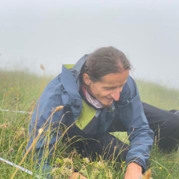

# Vegetation Classification Working Group
# VCWG Newsletter 3

## February 2026

([Newsletter in PDF](VCWG_Newsletter3.pdf))

## *Dear VCWG Members*

Welcome to the third issue of the **VCWG Newsletter**, where we share recent activities and upcoming plans of the Vegetation Classification Working Group of IAVS. In this issue we announce two upcoming Vegetation Classification Seminars, highlight our 2025 publications list, and share an update on the VCWG special session at the 67th IAVS Annual Symposium in Gijón.

---

## 1. Vegetation Classification Seminars – recent talks and upcoming dates

We are pleased that the VCWG _Vegetation Classification Seminars_ are now well underway. Recordings and short summaries are available on our website.

### Recent seminars:

-        **A proposal for a multi-level classification of the World’s terrestrial vegetation.** Javier Loidi, 3 December 2025. Abstract and video link are available [here](https://vcwg.org/Vegetation-Classification-Seminars/Seminar-2025-12-03).

-        **From natural history to forest classification: biogeographic and evolutionary foundations of Mediterranean white oak forest.** Carlos Vila-Viçosa, 28 January 2026. Abstract and video link are available [here](https://vcwg.org/Vegetation-Classification-Seminars/Seminar-2026-01-28).

---
### Upcoming seminars:

**_19 February 2026_**

**From peaks to permafrost: Vegetation classification in the Rocky Mountains and along the Dalton Highway, AK.** Speaker: _Jozef Šibík_. 

Registration is  via [link](https://events.teams.microsoft.com/event/02b57499-ab35-45a9-aea1-686f926a0091@16ed5ab4-2b59-4e40-806d-8a30bdc9cf26)

**Short abstract:** Alpine areas of the Rocky Mountains and Arctic Alaska are experiencing rapid ecological change driven by warming, glacier loss, and shifting nutrient cycles. This seminar presents ongoing work to classify and map alpine and Arctic vegetation using the Braun-Blanquet approach, linked to existing Arctic frameworks (including the Arctic Vegetation Classification and the Arctic Vegetation Archive). Preliminary results highlight strong contrasts between Arctic and alpine systems across North America and comparisons with analogous ecosystems in Europe. A key goal is to compile and revise a consistent list of North American syntaxa (including validation of published names and recognition of vicariant units) and to explore practical “crosswalks” between broad-scale schemes (e.g., USNVS/biome concepts) and finer-scale Braun–Blanquet units. The talk also outlines how remote sensing, GIS, and machine learning can support mapping and monitoring, and proposes a simple indicator framework focused on soil moisture and temperature for assessing ecosystem condition. 
More detailed abstract is available [via link](Seminar-2026-02-19.md)

***Dr. Jozef Šibík** is a senior researcher at Slovak Academy of Sciences, he is a vegetation ecologist with worldwide field experiences from ecosystems of four continents (South and North America (including Alaska), Europe and Africa). His studies are of an international importance for the ecology of species and communities, syntaxonomy and vegetation dynamics; enhancing the knowledge on the transnational and multidisciplinary level. The results of his work are used in the applied branches for elaboration of management practices for various habitat types and providing expertise affecting the habitat use and restoration in changing environment. He is a certified remote pilot, recognized by Slovakia’s national aviation authority. He is authorized to operate drones (UAVs) for reconnaissance flights. He utilizes remote technologies to examine landscapes and explore automation solutions for various research questions. At the same time, he is also deeply engaged in exploring acoustic diversity as a key component of biodiversity monitoring using acoustic recorders to capture a wide range of soundscapes in various habitats. This innovative approach allows him to analyze the presence and abundance of species through their vocalizations, providing insights into community dynamics and ecosystem health. This work not only enhances our understanding of species interactions and habitat use but also facilitates early detection of ecological changes, contributing to more effective conservation strategies.*

---

**_25 March 2026_**

**A proposal to catalogue and describe terrestrial ecosystems around the globe using the Braun-Blanquet and EcoVeg/International Vegetation Classification approaches.** Speakers: _Wolfgang Willner_ and _Don Faber-Langendoen_.

Registration is via [link](https://events.teams.microsoft.com/event/ae5b73b0-96f5-4461-80b2-d30f71c9632d@16ed5ab4-2b59-4e40-806d-8a30bdc9cf26).

**Short abstract:** Two major approaches to classifying terrestrial ecosystems around the globe are the EcoVeg/International Vegetation Classification approach and the Braun-Blanquet approach. Together they could provide a catalyst for standardizing a systematic catalogue and description of terrestrial ecosystems, as well as supporting regional/continental mapping, assessments of at-risk ecosystems (such as the IUCN Red List of Ecosystems) and guiding protection efforts. Both approaches have recently recognized the need to incorporate functional vegetation traits into the classification process (alongside floristic, biogeographic, and environmental factors), including through global functional biome concepts. This change also helps align these classifications with the global functional biome-based concepts of the Global Ecosystem Typology (GET), thereby addressing a critical need for standardized mid-level units not available in GET. Here we first introduce the BB approach, focusing on a historical perspective that highlights how the current IVC Ecobiome and GET Ecosystem Functional Group meet a longstanding need in that approach. We then consider and compare how the BB and EcoVeg approaches (including recent conceptual improvements), could foster development of a catalogue and description of regional/continental terrestrial ecosystems. 

|                                                                                                                                                                                                                                                                                                                                                                                                                                                                                                                                                                                                      |                                                                                                                                                                                                                                                                                                                                                                                                                                                                                                                                                                                                                                                                                                                             |
| --------------------------------------------------------------------------------------------------------------------------------------------------------------------------------------------------------------------------------------------------------------------------------------------------------------------------------------------------------------------------------------------------------------------------------------------------------------------------------------------------------------------------------------------------------------------------------------------------------------------------------------------------------------------- | -------------------------------------------------------------------------------------------------------------------------------------------------------------------------------------------------------------------------------------------------------------------------------------------------------------------------------------------------------------------------------------------------------------------------------------------------------------------------------------------------------------------------------------------------------------------------------------------------------------------------------------------------------------------------------------------------------------------------------------------------------------------------------------------- |
| ***Wolfgang Willner** is a vegetation scientist interested in vegetation classification and the current and historical biogeographical factors shaping the species composition of plant communities, with a special focus on Eurasian steppes and temperate forests. He received his PhD at the University of Vienna (Austria) where he worked as a Researcher at the Department of Conservation Biology, Vegetation and Landscape Ecology. Since 2004, he is Managing Director of the private research institute “Vienna Institute for Nature Conservation & Analyses (VINCA)”. Since 2011, he is also Lecturer for Vegetation Ecology at the University of Vienna.* | ***Don Faber-Langendoen** is Senior Ecologist and Conservation Methods Coordinator for NatureServe. He works closely with the NatureServe Network and partners across North America to advance NatureServe’s mission of identifying, tracking, and helping protect at-risk species and exemplary ecosystems. He has fostered standard methods for classifying and mapping the diversity of ecosystems (through the International Vegetation Classification) and to assess their at-risk status and ecological integrity. He engages with federal, state, provincial and territory partners to promote stewardship of biodiversity. He is a Regional Editor of the Ecological Society of America’s USNVC Peer Review Board and co-chairs the CNVC Committee. He lives in Syracuse, New York.* |

---

## 2. Publications by VCWG members from 2025

We have now published a list of vegetation-classification-related papers by VCWG members from **2025**, available here:

[https://vcwg.org/Publications-by-our-members/2025](https://vcwg.org/Publications-by-our-members/2025)

If you would like your publications to be included in this list, please contact Aaron Wells ([Aaron.Wells@aecom.com](mailto:Aaron.Wells@aecom.com)).

---

## 3. VCWG Special Session at the 67th IAVS Annual Symposium (Gijón, Spain)

We are organizing a special session at the 67th IAVS Annual Symposium International Association for Vegetation Science (IAVS) in Gijón, Spain Gijón:

**Bringing the different vegetation classification approaches together**

This session aims to connect major vegetation classification systems used globally. Targeted approaches include Braun-Blanquet phytosociology, EcoVeg, national habitat schemes, global biome and ecoregion maps, phylogenetically informed classifications and related frameworks. We invite presentations that provide comparative analyses, evaluate consistency across systems or develop integrative tools using vegetation-plot or trait data. Contributions may range from local to global scales. While we particularly welcome integrative and comparative studies, all contributions dealing with vegetation classification are welcome. (This special session will be used as a basis for assembling a Special Collection of articles in Vegetation Classification and Survey).

**Important update:** the deadline for abstract submissions has been extended until 17 February 2026.

---

## **Best regards,**

**VCWG Steering Committee**

Jorge Capello, John T. Hunter, Corrado Marcenò, Denys Vynokurov, Aaron Wells

---
[Home Page](index.md)
