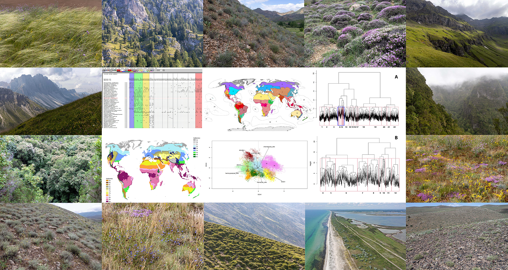

# Vegetation Classification Working Group

The **Vegetation Classification Working Group (VCWG)** is a part of the International Association for Vegetation Science ([IAVS](https://www.iavs.org/)), focused on enhancing the understanding and development of vegetation classification worldwide. Our mission is to connect ecologists working on vegetation classification at various levels – from local communities to global ecosystems – and to promote collaborative efforts in this field.

This website provides information on our initiatives, objectives, and events. Also, we plant to publish here recent publications of our members and blogposts. 

testing0
### [About Us](About%20Us.md)

### [[News]]

### [Initiatives](Initiatives.md) 

&nbsp;&nbsp;&nbsp;&nbsp;[[WorldVegChecklist]]

### [Publications](Publications.md) 

&nbsp;&nbsp;&nbsp;&nbsp;[Newsletter](Newsletter.md)

&nbsp;&nbsp;&nbsp;&nbsp;[VCWG Blog Posts](VCWG%20Blog%20Posts.md)

&nbsp;&nbsp;&nbsp;&nbsp;[Recent publications](Recent%20publications%20of%20our%20members.md)

&nbsp;&nbsp;&nbsp;&nbsp;[Special collections](Special%20Collections%20organized%20by%20VCWG.md)

### [Events](Events.md) 

 

Follow us on social media:
[Twitter](link), [Facebook](link)

